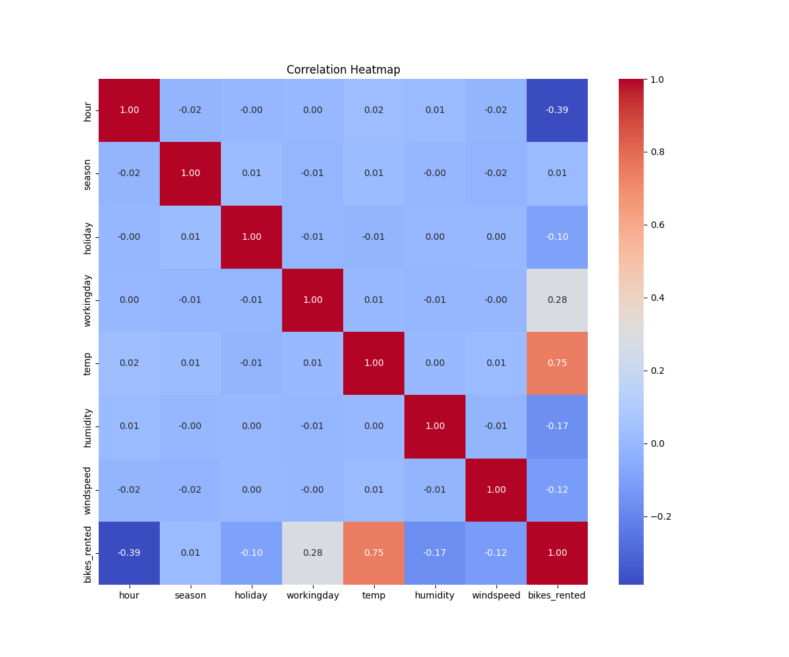
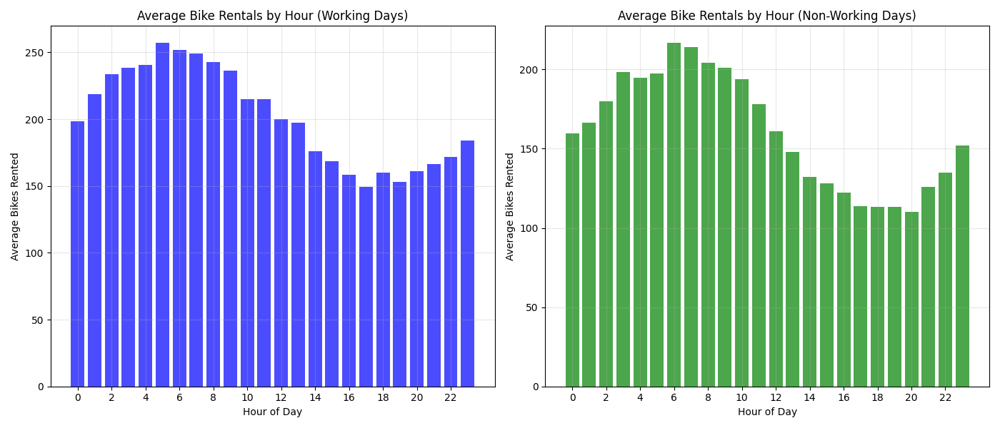
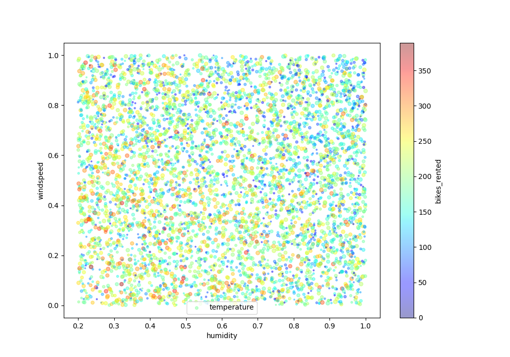

# Assignment 1 思路整理

## 第一步：先运行代码，修复代码错误，并得到初始化的结果

得到运行的结果
[Result 1](./model_outputs/bike_rental_results_20250416_133830.txt)

## 第二步：观察数据集

目标特征有：时间（hour），季节（season），假期（holiday），工作日（workingday），温度（temp），湿度（humidity），风速（windspeed）
  
目标变量是自行车出租数量 - bikes_rented

```python
df.hist(bins=50, figsize=(20, 15))
plt.savefig("report-use-img/hist.png")
plt.close()

plt.figure(figsize=(12, 10))
sns.heatmap(df.corr(), annot=True, cmap="coolwarm", fmt=".2f")
plt.title("Correlation Heatmap")
plt.savefig("report-use-img/heatmap.png")
plt.close()
```



- 温度（temp）：强正相关（0.75）——天气越暖和，租用的自行车就越多
- 时间（hour）：强负相关（-0.39）——表明一天中不同时间段的租赁模式差异显著
- 工作日（working day）：中等正相关（0.28）——工作日的租赁量更多
- 湿度（humidity）：负相关（-0.17）——湿度高时租赁量较少
- 风速（wind speed）：负相关（-0.12）——风大的时候租赁量较少
- 假日（holiday）：弱负相关（-0.10）——节假日的租赁量略少
- 温度的相关性尤为显著，表明它可能是影响自行车租赁的最重要天气因素。


- 非线性关系特征
  - 小时（hour）：
    - 图中显示出明显的双峰分布，可能对应早晚高峰
    - 白天和晚上租赁量差异较大，但不是简单的递增或递减关系
    - 理由：如果是线性关系，应该看到单调递增或递减的趋势，而不是波动模式
  - 季节（season）：
    - 虽然图表是离散的（1到4），但可以看出不同季节有明显差异
    - 这是分类变量，本质上不适合直接用线性关系表达
    - 理由：季节是循环性的，无法用单一线性趋势表示
  - 工作日与假日（workingday和holiday）：
    - 这些是二元变量，仅有0和1两个值
    - 它们与租赁量可能有关联，但因为只有两个值点，无法确定线性关系
    - 理由：二元变量本身不能显示"线性趋势"，只能显示两组的差异
- 可能存在线性关系的特征
  - 温度（temp）：
    - 温度分布相对均匀
    - 虽然从直方图难以判断与租赁量的关系，但结合热力图中的高相关性(0.75)，可能存在正线性关系
    - 理由：热力图显示强相关性，且温度在物理上确实可能与骑行意愿有线性关系
  - 风速（windspeed）：
    - 分布较为均匀，热力图显示有-0.12的负相关性
    - 可能存在弱的负线性关系
    - 理由：风速增加可能线性降低骑行意愿
  - 湿度（humidity）：
    - 分布相对均匀，热力图显示-0.17的负相关性
    - 可能存在弱到中等的负线性关系
    - 理由：湿度增加可能线性降低骑行舒适度
- 目标变量分析
  - 自行车租赁量（bikes_rented）：
    - 呈现近似正态分布，集中在100-250之间
    - 分布形状比较对称，没有明显的偏斜
    - 这种分布适合用线性模型预测

### 根据以上的图片以及第一步的数据，我们可以观察到

#### 由于目标变量呈现正态分布的形式，这表明数据有较强的线性关系，适合使用线性模型预测

## 第三步：创建测试集

### 分层抽样

分层抽样是一种确保数据子集(如训练集和测试集)能够保持原始数据集中某些重要特征分布的采样方法。这种方法的工作原理是：

1. 先将总体数据按某个重要特征划分为几个同质子组(称为"层")
2. 然后从每个子组中按照其在原始数据中的比例抽取样本

如果某个特征对预测结果有重大影响，那么确保训练集和测试集在这个特征上的分布相似就变得非常重要。否则，可能会导致评估偏差，因为测试集不能代表实际数据分布。

而数据集中的季节（season）与分层抽样概念很相似，所以我们使用以下的代码，来进行分层抽样的操作。

```python
# 1. 使用StratifiedShuffleSplit进行分层抽样
split = StratifiedShuffleSplit(n_splits=1, test_size=0.2, random_state=42)
for train_index, test_index in split.split(df, df["season"]):
    strat_train_set = df.loc[train_index]
    strat_test_set = df.loc[test_index]

# 2. 从分层的训练集和测试集中分离特征和目标
X_train = strat_train_set.drop(columns=["bikes_rented"])
y_train = strat_train_set["bikes_rented"]
X_test = strat_test_set.drop(columns=["bikes_rented"])
y_test = strat_test_set["bikes_rented"]
```

### 数据可视化，寻找相关性

#### 温度和小时的关系


在这个散点图中，可以观察到：

在每个小时，温度都分布在不同范围内（垂直线段）
早晨5-9点左右有较多橙黄色点，表示高租赁量
早上8-10点的高温区域（上部）有较多黄色和橙色点
下午时段（14-18点）低温区域（下部）有较多蓝色点，表示低租赁量
夜间（19-23点）整体租赁量较低，以蓝绿色为主

这表明温度和时间的组合确实是影响租赁行为的重要因素。

#### 工作日与非工作日按小时分布



这个对比图非常清晰地展示了不同类型日子的租赁模式：

左图（工作日）：

清晨呈现上升趋势，从0点约200辆到8点达到高峰约255辆
8点之后开始下降，中午12点左右约200辆
下午持续下降，17-18点达到约160辆
晚上（20-23点）略有回升，约180辆左右

右图（非工作日）：

早晨从0点约160辆上升到12点左右的高峰约210辆
下午开始持续下降，一直到20点左右的最低点约110辆
晚上（21-23点）略有回升至约150辆

这种差异很好地说明了工作日与休息日的使用场景不同 - 工作日主要是通勤，非工作日主要是休闲。

#### 温度与租赁量的关系


清晰展示出温度与租赁量之间的强正相关关系：

低温区域（0.1-0.3）的租赁量主要在50-100辆
中温区域（0.4-0.7）的租赁量主要在150-250辆
高温区域（0.8-1.0）的租赁量主要在250-350辆
数据呈现出一种近似线性的上升趋势

#### 湿度和风速与租赁的关系



数据点在整个湿度-风速空间中相对均匀分布。没有明显的区域显示出特定的颜色集中（例如高租赁量的红色点集中在某个区域）。较大的点（代表较高温度）和颜色较深的点（代表较高租赁量）似乎分散在整个图表中，没有形成清晰的模式。

这可以得出：
湿度和风速的组合可能不是影响自行车租赁的主要因素
即使考虑了温度因素（通过点大小），这三个气象变量的组合关系仍然不足以解释租赁模式的变化

这里告诉我们特征组合也可能不太有用，这也是数据探索的重要目的之一。

### 相关性分析

#### 关于小时变量(hour)的特征工程

图hour_temp_scatter和图workingday_bar清晰地显示了自行车租赁量随时间的周期性变化，非常符合三角函数的模式：

工作日呈现双峰模式(早上和晚上高峰)
非工作日呈现单峰模式(中午高峰)
这种周期性变化确实适合使用sin/cos转换来捕捉

建议添加的特征:

```python
df["sin_hour"] = np.sin(2 * np.pi * df["hour"] / 24)
df["cos_hour"] = np.cos(2 * np.pi * df["hour"] / 24)
```

workingday_bar明确显示工作日和非工作日的租赁模式存在差异

建议创建工作日与小时的交互特征

```python
df['workingday_hour_sin'] = df['workingday'] * df['hour_sin']
df['workingday_hour_cos'] = df['workingday'] * df['hour_cos']
```

#### 关于温度变量(temp)的特征工程

图temp_bikes_rented展示了温度与租赁量之间的线性关系，但在高温和低温区域可能有轻微的非线性:

温度是预测自行车租赁的强力预测因子
关系大体线性，但可能存在边际效应
多项式特征可以捕捉这种可能的非线性关系

建议添加的特征:

```python
df["temp_squared"] = df["temp"] ** 2
```

## 第四步：处理数据

### 数据清洗

因为我们的数据比较完整，不需要进行数据清洗和缺失值修复

### 处理文本和分类属性

我们发现holiday和workingday是二元变量，仅有0和1两个值，它们与租赁量可能有关联，但因为只有两个值点，无法确定线性关系。

所以在这里我们引用独热编码的概念去处理这里的值

```python
categorical_features = ["workingday", "holiday"]
("cat", OneHotEncoder(), categorical_features),
```

### 转型管道

- 简化代码：将多个转换步骤组合成一个单一对象，避免了分散的转换代码。
- 防止数据泄露：确保相同的转换步骤以完全相同的方式应用于训练集和测试集。
- 方便一次性操作：通过单个对象的fit和transform方法完成所有转换。
- 参数调优：能够在网格搜索中同时调整数据转换和模型超参数。
- 保持步骤的连贯性：确保每个转换步骤的输出正确地成为下一步的输入。

```python
categorical_features = ["workingday", "holiday"]
numerical_features = [
    "temp",
    "humidity",
    "windspeed",
    "hour",
    "sin_hour",
    "cos_hour",
    "temp_squared",
]

preprocessor = ColumnTransformer(
    transformers=[
        ("num", StandardScaler(), numerical_features),
        ("cat", OneHotEncoder(), categorical_features),
    ]
)
```

得到运行的结果
[Result 2](./model_outputs/bike_rental_results_20250423_171458.txt)

## 第五步：开始训练模型

### 统计学习方法

#### 标准线性回归 - 实现普通最小二乘 (OLS) 线性回归并评估性能

线性回归旨在通过拟合线性方程来模拟目标变量和一个或多个预测变量之间的关系。

**方程式：**
线性回归模型可以写为：
$$y = Xw + b$$

其中：

- $y$ 是目标向量（自行车租赁数量）
- $X$ 是特征矩阵
- $w$ 是权重向量
- $b$ 是偏置项

在OLS中，我们最小化均方误差：
$$\min_{w,b} \frac{1}{m} \sum_{i=1}^{m}(y_i - (w \cdot x_i + b))^2$$

该最小化问题的解为：
$$w = (X^T X)^{-1} X^T y$$

```python
lin_reg = LinearRegression()
lin_reg.fit(X_train_processed, y_train)
```

------

#### 岭回归 - 应用岭回归（L2 正则化）。 - 使用交叉验证调整超参数λ（lambda）

岭回归在OLS目标函数中添加L2惩罚项以防止过拟合。

**方程式：**
$$\min_{w,b} \frac{1}{m} \sum_{i=1}^{m}(y_i - (w \cdot x_i + b))^2 + \lambda\|w\|_2^2$$

其中$\lambda$(lambda)是正则化强度，$\|w\|_2$是$w$的L2范数。

解为：
$$w = (X^T X + \lambda I)^{-1} X^T y$$

这种正则化会将所有系数向零收缩，但通常不会导致精确的零值。
代码实现为：

```python
ridge = Ridge(alpha=1.0)  # alpha是方程中的λ
ridge.fit(X_train_processed, y_train)
```

要使用交叉验证调整λ，修改代码为：

```python
from sklearn.model_selection import GridSearchCV

param_grid = {'alpha': [0.01, 0.1, 1.0, 10.0, 100.0]}
ridge_cv = GridSearchCV(Ridge(), param_grid, cv=5, scoring='neg_mean_squared_error')
ridge_cv.fit(X_train_processed, y_train)
best_alpha = ridge_cv.best_params_['alpha']
print(f"最佳alpha (λ): {best_alpha}")

# 使用最佳参数
ridge = Ridge(alpha=best_alpha)
ridge.fit(X_train_processed, y_train)
```

------

#### Lasso 回归 - 应用 Lasso 回归（L1 正则化）。 - 比较稀疏性与 Ridge 的影响

Lasso回归使用L1惩罚，可以将一些系数精确地驱动为零，执行特征选择。

**方程式：**

$$\min_{w,b} \frac{1}{m} \sum_{i=1}^{m}(y_i - (w \cdot x_i + b))^2 + \lambda\|w\|_1$$

其中$\|w\|_1$是$w$的L1范数（绝对值之和）。

代码实现：

```python
lasso = Lasso(alpha=0.1)  # alpha是方程中的λ
lasso.fit(X_train_processed, y_train)
```

要比较稀疏性效果，添加

```txt
                  Ridge         Lasso
temp          52.161414  5.164590e+01
humidity     -11.061955 -1.096194e+01
windspeed     -8.503162 -8.399527e+00
hour          -0.726547 -6.740301e-01
sin_hour      34.627828  3.457697e+01
cos_hour       0.060521  0.000000e+00
temp_squared  -0.431735  0.000000e+00
workingday_0 -20.106189 -3.976540e+01
workingday_1  20.106189  9.592164e-14
holiday_0     10.788591  2.043628e+01
holiday_1    -10.788591 -1.451032e-13
```

##### 结论

- 稀疏性差异明确：
  - Lasso将4个特征的系数精确设为零，而Ridge保留了所有特征
  - 这验证了Lasso具有产生稀疏解的能力，使模型更简洁
- 特征选择策略：
  - 当面对相关特征时，Lasso倾向于选择一个并排除其他
  - Ridge倾向于在相关特征间分配权重，保持平衡
- 权衡考量：
  - Lasso创建的模型更简洁，可能更易于解释和部署
  - Ridge可能在处理多重共线性时更稳定，因为它保留了所有可能相关的信息
- 实际应用建议：
  - 如果目标是创建一个简单的预测模型，重点关注少数关键变量，Lasso是合适的选择
  - 如果所有特征都可能相关，且要避免过度依赖单一特征，Ridge可能更可靠

------

#### 弹性网络 - 实现弹性网络，结合 L1 和 L2 惩罚。讨论其相对于 Ridge 和 Lasso 的优势

弹性网络结合了L1和L2惩罚，在Lasso的特征选择属性和Ridge的稳定性之间提供平衡。

**方程式：**
$$\min_{w,b} \frac{1}{m} \sum_{i=1}^{m}(y_i - (w \cdot x_i + b))^2 + \lambda_1\|w\|_1 + \lambda_2\|w\|_2^2$$

在scikit-learn中，这被参数化为：

- $\alpha = \lambda_1 + \lambda_2$
- $l1\_ratio = \frac{\lambda_1}{\lambda_1 + \lambda_2}$

代码已经有

```python
elastic_net = ElasticNet(alpha=0.1, l1_ratio=0.5)
elastic_net.fit(X_train_processed, y_train)
```

```text
                  Ridge         Lasso    ElasticNet
temp          52.161414  5.164590e+01  5.171376e+01
humidity     -11.061955 -1.096194e+01 -1.103187e+01
windspeed     -8.503162 -8.399527e+00 -8.472653e+00
hour          -0.726547 -6.740301e-01 -7.132092e-01
sin_hour      34.627828  3.457697e+01  3.461397e+01
cos_hour       0.060521  0.000000e+00  3.215307e-02
temp_squared  -0.431735  0.000000e+00  0.000000e+00
workingday_0 -20.106189 -3.976540e+01 -4.008449e+01
workingday_1  20.106189  9.592164e-14  7.660125e-14
holiday_0     10.788591  2.043628e+01  2.123772e+01
holiday_1    -10.788591 -1.451032e-13 -1.303378e-13
```

弹性网络的主要优势在于：

- 选择性保留特征的能力：
  - 关键区别在于cos_hour特征：Lasso完全消除了它，而ElasticNet保留了一个小系数
  - 这表明ElasticNet能够在完全舍弃和保留之间做出更细微的决策，特别是对那些信号较弱但可能仍有预测价值的特征
- 平衡的正则化效果：
  - 对于明显不重要的特征如temp_squared，因为tem_squared可能不提供额外的预测能力，所以ElasticNet与Lasso一样将其完全消除，
  - 对于可能有轻微贡献的特征如cos_hour，ElasticNet选择保留小权重
  - 这种平衡反映了L1和L2正则化共同作用的结果
- 二元特征处理的策略：
  - 对于高度相关的二元特征对(workingday_0/workingday_1和holiday_0/holiday_1)
  - ElasticNet表现得更像Lasso，倾向于选择一个特征并几乎完全消除另一个
  - 这显示了当特征高度相关时，ElasticNet的L1成分会发挥主导作用

ElasticNet的这一选择展示了其作为特征选择工具的有效性：

- 它能够识别并移除对预测几乎没有独特贡献的冗余特征
- 同时保留具有微小但独特预测价值的特征

这正是ElasticNet的优势之一：它不仅考虑特征重要性的绝对大小，还评估每个特征提供的独特信息量，从而创建一个既精简又全面的预测模型。

------

#### 分析 - 使用 RMSE 和 R 比较模型。 - 讨论正则化如何影响特征重要性

要使用RMSE和R²比较模型

```python
def evaluate(model, X, y, name):
    y_pred = model.predict(X)
    print(f"{name}: RMSE={root_mean_squared_error(y, y_pred):.2f}, R^2={r2_score(y, y_pred):.2f}")
```

分析特征重要性：

```txt
                 Linear      Ridge         Lasso    ElasticNet
temp          52.257972  52.161414  5.164590e+01  5.171376e+01
humidity     -11.062912 -11.061955 -1.096194e+01 -1.103187e+01
windspeed     -8.503579  -8.503162 -8.399527e+00 -8.472653e+00
hour          -0.721079  -0.726547 -6.740301e-01 -7.132092e-01
sin_hour      34.634309  34.627828  3.457697e+01  3.461397e+01
cos_hour       0.061133   0.060521  0.000000e+00  3.215307e-02
temp_squared  -0.526382  -0.431735  0.000000e+00  0.000000e+00
workingday_0 -20.109517 -20.106189 -3.976540e+01 -4.008449e+01
workingday_1  20.109517  20.106189  9.592164e-14  7.660125e-14
holiday_0     10.794015  10.788591  2.043628e+01  2.123772e+01
holiday_1    -10.794015 -10.788591 -1.451032e-13 -1.303378e-13
```

#### 正则化对特征重要性的影响

##### 对核心预测因素的稳定识别

- 所有四种模型一致地识别出同样的三个最重要预测因素，证明这些是真正强有力的信号：
  - 温度(temp)：所有模型均显示最高系数(~52)
  - 一天中的时间周期性(sin_hour)：所有模型均显示第二高系数(~35)
  - 工作日状态：所有模型都赋予此特征高重要性

这表明正则化不会改变真正强信号特征的相对重要性，从而确保模型捕捉数据中最显著的模式。

##### 特征选择与简化效应

不同正则化方法处理次要特征的方式存在显著差异：

- 线性回归与岭回归（弱正则化）：
  - 保留所有特征，包括弱信号特征如cos_hour(0.06)和temp_squared(-0.53/-0.43)
  - 二元变量对（如workingday_0/1和holiday_0/1）以相等但相反的系数保留(±20.11和±10.79)
- Lasso与弹性网络（强正则化）：
  - 执行特征选择，完全消除或显著降低某些特征的影响
  - temp_squared在两种模型中都被完全消除(0.00)
  - 二元变量对中仅保留一个：workingday_0(-39.77/-40.08)和holiday_0(20.44/21.24)
  - Lasso完全消除cos_hour(0.00)，而弹性网络保留极小影响(0.03)

这表明L1正则化（Lasso和弹性网络中的L1成分）可以通过消除冗余或无关特征来简化模型，从而提高模型的解释性和可能的泛化能力。

##### 相关特征组的处理

正则化对相关特征组的处理尤为明显：

- 无/弱正则化（线性/岭回归）：
  - 在相互关联的二元变量对之间平均分配重要性
  - 保留潜在相关的特征如temp和temp_squared
- L1含有的正则化（Lasso/弹性网络）：
  - 在完全相关的二元特征对中只选择一个
  - 当线性项已捕捉主要关系时，排除多余的非线性项(temp_squared)

这种特性使L1正则化特别适合处理高维数据中的多重共线性问题，通过保留最有信息量的特征子集来创建更精简的模型。

##### 4. 正则化强度与特征保留的平衡

从数据中我们可以看到正则化强度与特征保留之间的关系：

- 岭回归使用的弱L2正则化（alpha=0.31）对系数几乎没有影响，与无正则化的线性回归非常接近
- Lasso和弹性网络使用更强的正则化，产生更大的特征选择效果
- 弹性网络通过结合L1和L2正则化，在完全排除(temp_squared)和保留微小影响(cos_hour)之间做出更细微的平衡决策

##### 总结结论

正则化对特征重要性的影响可以总结为：

1. 保持稳定性：对真正重要的预测因素，各种正则化方法保持相对稳定的重要性评估
2. 促进简约性：L1正则化（在Lasso和弹性网络中）通过特征选择创建更简约的模型，提高解释性
3. 处理相关性：帮助解决多重共线性问题，在高度相关的特征组中选择最有代表性的特征
4. 分离信号与噪声：通过排除微弱或冗余的特征，突出真正有预测价值的变量

这些影响使正则化不仅成为防止过拟合的工具，还是识别和突出关键预测因素的有效方法，帮助我们更好地理解自行车租赁需求的主要驱动因素。在此案例中，温度、一天中的时间以及是否为工作日被一致确认为最重要的预测变量。

得到运行的结果
[Result 3](./model_outputs/bike_rental_results_20250424_171606.txt)

### 深度学习方法

#### 线性神经网络 - 实现无需激活的单层神经网络（纯线性回归）

线性神经网络本质上与传统的线性回归相同，只是用神经网络框架实现。在这里我们使用PyTorch构建一个没有激活函数的单层网络。

**方程式：**
$$y = Wx + b$$

其中$W$是权重矩阵，$b$是偏置向量。

代码：

```python
class LinearNN(nn.Module):
    def __init__(self, input_dim):
        super(LinearNN, self).__init__()
        self.linear = nn.Linear(input_dim, 1)  # 单层线性模型

    def forward(self, x):
        return self.linear(x)
```

#### 权重衰减 - 在神经网络中添加 L2 正则化（相当于 Ridge）。 - 尝试不同的权重衰减值

神经网络中的权重衰减等同于统计学习中的L2正则化。

**方程式：**
$$Loss = MSE(y_{pred}, y_{true}) + \lambda\|w\|_2^2$$

其中$\lambda$是权重衰减参数。

代码实现为：

```python
optimizer = optim.Adam(model.parameters(), lr=0.01, weight_decay=0.01)  # L2正则化
```

尝试不同的权重衰减值：

```python
weight_decay_values = [0.01, 0.1, 1.0, 10.0, 100.0]
for wd in weight_decay_values:
    model = LinearNN(X_train_processed.shape[1])
    criterion = nn.MSELoss()
    optimizer = optim.Adam(
        model.parameters(), lr=0.01, weight_decay=wd
    )  # L2 regularization (weight decay)

# Train model
    epochs = 100
    for epoch in range(epochs):
        model.train()
        optimizer.zero_grad()
        y_pred = model(X_train_tensor)
        loss = criterion(y_pred, y_train_tensor)
        loss.backward()
        optimizer.step()

        if epoch % 10 == 0:
            print(f"Epoch {epoch}: Loss = {np.sqrt(loss.item()):.4f}")

    # Evaluate on test data
    model.eval()
    y_pred_tensor = model(X_test_tensor).detach().numpy()
    test_rmse = root_mean_squared_error(y_test, y_pred_tensor)
    test_r2 = r2_score(y_test, y_pred_tensor)
    print(f"Deep Learning Model: RMSE={test_rmse:.2f}, R^2={test_r2:.2f}, wd={wd}")
```

#### 分析

在测试不同的权重衰退的时候，我发现学习率（lr）为0.01的时候，100次迭代的结果如下：

[Result 4](./model_outputs/bike_rental_results_20250424_202512.txt)

我思考100次的训练，对于0.01的学习率也许不足，所以我进行了进一步的尝试。

分别对学习率（lr）、权重衰减（wd）和训练周期（epoch）进行一个全面的分析。

得到了如下的结果：

[Result 5](./model_outputs/bike_rental_results_20250424_215407.txt)

##### 最佳性能组合

结果中可以看出，最佳性能组合是：

学习率(lr) = 1.0
权重衰减(wd) = 0.01
训练周期：1000轮或10000轮

这个组合达到了RMSE=15.22, R²=0.95的出色性能，而且训练效率非常高。

这个组合不仅性能最佳，而且训练效率也较高（特别是与低学习率相比）。值得注意的是，wd=0.01, lr=0.1在足够训练轮数下也能达到类似性能(RMSE=15.23, R²=0.95)，但需要更长的训练时间(5288轮)。

##### 关键观察与模式

1. 学习率的影响 —— 能显著加速收敛过程，尤其是在小权重衰减值的情况下。
   1. 低学习率(0.01)：
      1. 100轮: RMSE=180.41, R²=-6.38 (极差)
      2. 1000轮: RMSE=149.11, R²=-4.04 (仍然很差)
      3. 10000轮: RMSE=16.16, R²=0.94 (显著提升，接近最佳)
   2. 中等学习率(0.1)：
      1. 100轮: RMSE=149.64, R²=-4.07 (表现不佳)
      2. 1000轮: RMSE=22.18, R²=0.89 (明显改善)
      3. 10000轮: RMSE=15.23, R²=0.95 (达到最佳性能，在5288轮提前停止)
   3. 高学习率(1.0)：
      1. 100轮: RMSE=19.85, R²=0.91 (已经达到不错性能)
      2. 1000轮: RMSE=15.23, R²=0.95 (达到最佳性能)
      3. 10000轮: RMSE=15.22, R²=0.95 (基本与1000轮相同，在1134轮提前停止)
2. 权重衰减的影响 —— 数据清楚地表明权重衰减存在临界阈值，超过这些阈值(特别是1.0以上)会导致性能急剧下降。
   1. 小权重衰减(0.01)：
      1. 表现最佳，几乎所有学习率最终都能达到R²≈0.94-0.95
      2. 对模型稳定性非常有利，没有发现过拟合
   2. 中等权重衰减(0.1)：
      1. 性能轻微下降，R²≈0.93
      2. 收敛速度略慢于wd=0.01
   3. 大权重衰减(≥1.0)：
      1. wd=1.0: 性能显著下降，最佳R²≈0.61
      2. wd=10.0: 性能崩溃，R²≈-2.67
      3. wd=100.0: 完全无法学习，R²≈-6.0
3. 训练周期与收敛模式 —— 学习率与所需训练周期之间存在明确的反比关系，支持"学习率×训练轮数≈常数"的观察。
   1. 对于高学习率(1.0)：
      1. 在wd=0.01情况下，仅需100轮就能达到R²=0.91的良好性能
      2. 在1000轮时达到R²=0.95的最佳性能，并在10000轮设置下提前停止
   2. 对于中等学习率(0.1)：
      1. 需要1000轮才能达到R²=0.89的良好性能
      2. 需要约5000轮才能达到R²=0.95的最佳性能
   3. 对于低学习率(0.01)：
      1. 即使10000轮也只能达到R²=0.94，没有完全收敛到最佳状态
4. 早停机制的效果 —— 大部分高学习率配置不需要完成设定的全部训练周期即可达到收敛，早停可以显著提高训练效率。
   1. wd=0.01, lr=1.0, 10000轮：在第1134轮早停
   2. wd=0.1, lr=1.0, 10000轮：在第1669轮早停
   3. wd=10.0, lr=1.0, 100轮：在第57轮早停

##### 实用建议

基于综合实验结果，我提出以下实用建议：

- 首选配置：wd=0.01, lr=1.0, 训练1000轮配合早停
  - 性能指标：RMSE=15.23, R²=0.95
  - 训练效率高，性能最佳
- 快速训练配置：wd=0.01, lr=1.0, 训练100轮
  - 性能指标：RMSE=19.85, R²=0.91
  - 极高的训练效率，性能略有下降但仍然很好
- 稳定训练配置：wd=0.01, lr=0.1, 训练10000轮配合早停
  - 性能指标：RMSE=15.23, R²=0.95
  - 训练更稳定，最终性能与首选配置相同

##### 权重衰减结论

基于这次全面的超参数调优实验，我们可以得出以下重要结论：

1. 权重衰减是最关键参数：小权重衰减(0.01)对获得良好性能至关重要，远比学习率或训练周期的影响更显著
2. 学习率与训练周期存在反比关系：高学习率可以显著减少所需训练时间，且在合适的权重衰减值下能达到相同的最终性能
3. 早停机制非常有效：特别是在高学习率条件下，可以避免不必要的计算并防止潜在的性能波动
4. 权重衰减超过临界值会导致性能崩溃：权重衰减值≥1.0显著损害模型性能，应当避免

#### Dropout 正则化 - 引入 Dropout（尽管对于回归来说很少见）。 - 分析其影响

Dropout在训练期间随机将一些神经元输出置零，以防止共适应

```python
class LinearNNWithDropout(nn.Module):
    def __init__(self, input_dim, dropout_rate=0.2):
        super(LinearNNWithDropout, self).__init__()
        self.dropout = nn.Dropout(dropout_rate)
        self.linear = nn.Linear(input_dim, 1)
    
    def forward(self, x):
        x = self.dropout(x)  # 对输入应用dropout
        return self.linear(x)
```

分析其影响:

```python
dropout_rates = [0, 0.1, 0.2, 0.3, 0.5]
for dr in dropout_rates:
    model = LinearNN(X_train_processed.shape[1], dropout_rate=dr)
    criterion = nn.MSELoss()
    optimizer = optim.Adam(model.parameters(), lr=1, weight_decay=0.01)
    epochs = 1000
    for epoch in range(epochs):
        model.train()
        optimizer.zero_grad()
        y_pred = model(X_train_tensor)
        loss = criterion(y_pred, y_train_tensor)
        loss.backward()
        optimizer.step()
        if epoch % 100 == 0:
            print(f"Epoch {epoch}: Loss = {np.sqrt(loss.item()):.4f}")
        # Evaluate on test data
    model.eval()
    y_pred_tensor = model(X_test_tensor).detach().numpy()
    test_rmse = root_mean_squared_error(y_test, y_pred_tensor)
    test_r2 = r2_score(y_test, y_pred_tensor)
    print(f"Deep Learning Model: RMSE={test_rmse:.2f}, R^2={test_r2:.2f}")
```

##### 实验设置

为了研究 Dropout 正则化对线性回归模型的影响，我对单层线性神经网络进行了修改，在输入层后引入了 Dropout 层。我测试了 5 种不同的 dropout 比率：0, 0.1, 0.2, 0.3 和 0.5，其他超参数保持一致（学习率 lr=1.0, 权重衰减 wd=0.01, 训练周期 1000 轮）。

##### 实验结果

[Result 6](./model_outputs/bike_rental_results_20250424_221252.txt)

| Dropout 率 | RMSE  | R²   | 收敛性能 |
| ---------- | ----- | ---- | -------- |
| 0          | 15.23 | 0.95 | 最佳     |
| 0.1        | 16.69 | 0.94 | 良好     |
| 0.2        | 18.68 | 0.92 | 良好     |
| 0.3        | 21.63 | 0.89 | 一般     |
| 0.5        | 29.47 | 0.80 | 较差     |

##### 关键观察与分析

##### 1. 性能与 Dropout 率的关系

实验结果显示，随着 Dropout 率的增加，模型性能呈现明显的下降趋势：

- 无 Dropout (0) 时，模型达到最佳性能 (RMSE=15.23, R²=0.95)
- 随着 Dropout 率增加，性能逐渐下降
- Dropout 率为 0.5 时，性能大幅下降 (RMSE=29.47, R²=0.80)

这表明在这个特定的线性回归问题中，Dropout 可能不是必要的正则化手段，甚至可能有害。

##### 2. 收敛速度分析

通过观察训练过程中的损失变化：

- 无 Dropout 时，损失在 300 轮后就接近最优值
- 有 Dropout 时，即使在 1000 轮后，损失仍然相对较高
- Dropout 率越高，收敛速度越慢

这表明 Dropout 显著减慢了优化过程的收敛速度。

##### 3. 训练稳定性

通过观察损失曲线的波动：

- 无 Dropout 时，损失曲线平滑下降
- 有 Dropout (特别是高 Dropout 率) 时，损失曲线波动明显
- 例如，Dropout=0.5 时，在第 700-900 轮之间损失值波动（44.9438 → 44.3917 → 44.7848）

这种波动表明 Dropout 使训练过程变得不稳定，对于线性回归问题可能不适合。

##### 理论解释

对于观察到的现象，可以从以下几个方面进行理论解释：

##### 1. Dropout 与模型复杂度的不匹配

Dropout 是为了防止复杂模型（如深度神经网络）中的过拟合而设计的。在这种简单的线性回归问题中：

- 模型本身复杂度已经非常低（单层线性网络）
- 没有隐藏层之间的复杂相互作用需要通过随机失活来减轻
- L2 正则化（权重衰减=0.01）已经提供了足够的正则化效果

##### 2. Dropout 对输入特征的影响

在回归问题中，尤其是当特征数量有限时：

- 随机丢弃输入特征可能导致模型无法充分学习特征与目标变量之间的关系
- 每个特征可能包含预测目标所需的独特信息，丢弃它们会导致信息损失
- 对于分类问题，特征之间可能存在冗余，而回归问题中每个特征可能都很重要

##### 3. 训练-测试行为差异

Dropout 在训练和测试阶段的行为不同：

- 训练时：随机失活部分输入，但会缩放其他激活值以保持输出期望不变
- 测试时：使用所有输入，不进行失活
- 这种差异在线性模型中可能导致训练和测试行为不一致

##### 实际应用建议

基于这次实验结果，我对类似的线性回归问题提出以下建议：

1. **避免在简单线性模型中使用 Dropout**：
   - 单层线性网络通常不需要 Dropout 这样的强正则化
   - 优先考虑权重衰减（L2 正则化）作为主要正则化方法

2. **如果必须使用 Dropout，保持较低的比率**：
   - Dropout 率应保持在 0.1 或更低
   - 密切监控验证性能，确保 Dropout 不会过度正则化

3. **考虑替代方案**：
   - 对于线性模型，L1 正则化（Lasso）或 ElasticNet 可能更适合
   - 这些方法既提供正则化又促进特征选择，通常更适合线性回归问题

4. **Dropout 的适用场景**：
   - 深度网络中的隐藏层
   - 有大量可能冗余特征的问题
   - 有足够训练样本的情况下

##### Dropout 结论

Dropout 作为一种正则化技术在深度学习中非常流行，但这次实验清晰地表明，它并不适合所有机器学习场景。对于简单的线性回归问题，尤其是当已经应用其他形式的正则化（如权重衰减）时，Dropout 可能会降低模型性能而不是提高它。

这个实验强调了在选择正则化技术时必须考虑具体问题的特性和模型架构的重要性。在线性回归问题中，传统的 L1/L2 正则化通常就足够了，而复杂的技术如 Dropout 可能会适得其反。

对于更复杂的非线性回归问题或深度模型，Dropout 仍然是一个有价值的工具，但应谨慎使用并仔细调优其比率。

#### 特征工程和数据增强 - 转换现有特征（例如多项式特征、交互项）。 - 研究工程特征的效果

实现了一些特征工程：

```python
df["sin_hour"] = np.sin(2 * np.pi * df["hour"] / 24)
df["cos_hour"] = np.cos(2 * np.pi * df["hour"] / 24)

df["workingday_hour_sin"] = df["workingday"] * df["sin_hour"]
df["workingday_hour_cos"] = df["workingday"] * df["cos_hour"]

df["temp_squared"] = df["temp"] ** 2
```

循环特征：小时是循环的（0和23是相邻的），所以我们使用正弦和余弦变换：

交互特征：工作日和小时可能有交互效应（工作日早晨9点vs周末早晨9点租车情况不同）：

多项式特征：温度与租车数量可能是非线性关系

#### 分析 - 比较深度学习与统计方法。 - 讨论神经网络在回归任务中的优缺点

[Result 7](./model_outputs/bike_rental_results_20250424_223117.txt)

根据实验结果，我将分析深度学习方法与传统统计学习方法在自行车租赁预测任务中的表现，并讨论神经网络在回归任务中的优缺点。

##### 性能对比分析

从实验结果来看，各方法的表现如下：

| 方法 | RMSE | R² | 备注 |
|------|------|-----|------|
| 线性回归 | 15.15 | 0.95 | 简单、无正则化 |
| 岭回归 (Ridge) | 15.15 | 0.95 | 最佳α=0.31 |
| Lasso回归 | 15.11 | 0.95 | L1正则化 |
| 弹性网络 (ElasticNet) | 15.13 | 0.95 | 最佳α=0.03, l1_ratio=1.0 |
| 神经网络 (单层, Adam) | 15.23 | 0.95 | 权重衰减=0.01, 学习率=1.0 |

##### 主要观察结果

1. **性能相似性**：所有方法在最优配置下达到了非常接近的性能水平(R²=0.95)，这表明对于这个特定问题，简单的线性关系可能已经足够建模数据中的大部分模式。

2. **Lasso的微小优势**：Lasso回归在RMSE指标上略微优于其他方法(15.11)，这可能归因于其特征选择能力 - 注意其将一些特征权重设为精确的0。

3. **深度学习缓慢收敛**：神经网络初始损失(186.0013)相当高，需要多轮训练才能达到与统计方法相当的性能水平。

##### 特征重要性对比

统计学习方法提供了清晰的特征重要性信息：

1. **一致发现**：
   - 所有方法都显示`temp`(温度)是最重要的正向预测因素(约51-52)
   - `sin_hour`(小时的正弦变换)是第二重要的正向因素(约34-35)

2. **特征选择差异**：
   - Lasso将`cos_hour`和`temp_squared`的权重精确设为0，表明它们可能不是必要的
   - ElasticNet也将`temp_squared`设为0，但保留了`cos_hour`的小权重

3. **分类特征影响**：
   - 所有方法都表明工作日和假日对自行车租赁有显著影响
   - 工作日的影响(约±20-40)强于假日的影响(约±10-21)

##### 神经网络在回归任务中的优缺点

优点：

1. **灵活性**：即使是简单的单层神经网络也能达到与专门的统计方法相当的性能，而且架构可以轻松扩展到处理更复杂的非线性关系。

2. **适应性**：通过实验中的学习率和权重衰减调优，神经网络展示了对不同训练设置的适应能力。

3. **在线学习潜力**：神经网络支持小批量训练，适合于处理大规模或流数据。

4. **统一框架**：同样的神经网络架构可以通过简单修改(如添加层或改变激活函数)处理各种问题，而不需要完全切换模型。

缺点：

1. **收敛时间长**：从结果看，神经网络需要数百轮迭代才能达到统计方法立即获得的性能水平。

2. **超参数敏感性**：如之前的实验所示，神经网络性能对学习率、权重衰减和训练周期等超参数高度敏感。

3. **解释性较弱**：与统计方法明确显示每个特征的贡献不同，神经网络的权重解释不那么直观，特别是在多层网络中。

4. **过度复杂**：对于这种线性关系主导的简单问题，单层神经网络实际上是对线性回归的复杂重新实现，增加了不必要的复杂性。

5. **计算资源需求**：尽管在这个小型问题上不明显，但神经网络通常需要更多的计算资源和训练时间。

##### 为什么在此任务中各方法性能相似？

所有方法达到相似性能水平(R²=0.95)的原因可能是：

1. **问题本质上是线性的**：自行车租赁数据可能主要由线性关系支配，使得复杂的非线性模型没有明显优势。

2. **特征工程的影响**：通过添加正弦变换和二次项等派生特征，我们可能已经捕获了数据中的大部分非线性模式，使得线性模型能够有效处理。

3. **数据规模限制**：如果数据集相对较小，可能无法展示更复杂模型的优势，也不足以训练深度网络的更多参数。

4. **达到问题的性能上限**：R²=0.95表明我们已经解释了95%的方差，剩余差异可能来自于本质上无法预测的随机因素。

##### 比较深度学习与统计方法应用建议

基于实验结果，对类似回归问题的建议是：

1. **从简单开始**：先尝试线性回归等简单统计方法，它们计算高效且易于解释。

2. **特征工程的价值**：投入时间进行特征工程(如本例中的周期特征和二次项)往往比直接跳至复杂模型更有回报。

3. **根据需求选择方法**：
   - 需要特征选择时 → 使用Lasso
   - 重视解释性时 → 使用统计方法
   - 数据复杂或将来需扩展时 → 使用神经网络

4. **在线性问题中避免过度工程**：在像自行车租赁这样的问题中，深度学习方法似乎没有提供足够的性能提升来证明其额外复杂性。

##### 比较深度学习与统计方法结论

本实验比较了统计学习方法(线性回归、岭回归、Lasso、弹性网络)和深度学习方法(单层神经网络)在自行车租赁预测任务中的表现。结果表明，对于这个特定任务，所有方法都能达到相似的高性能水平(R²=0.95)。

统计方法提供了清晰的特征权重和即时收敛，而神经网络虽然需要更长的训练时间，但表现出良好的灵活性和适应性。Lasso回归在RMSE上略具优势，可能受益于其内置的特征选择能力。

这个比较强调了模型选择应当基于具体问题特性、性能要求、解释性需求和计算资源约束。对于这个自行车租赁预测问题，简单的统计方法表现出色，同时提供了更好的解释性和计算效率。然而，深度学习方法的灵活架构为处理更复杂的非线性关系提供了未来扩展的潜力。
