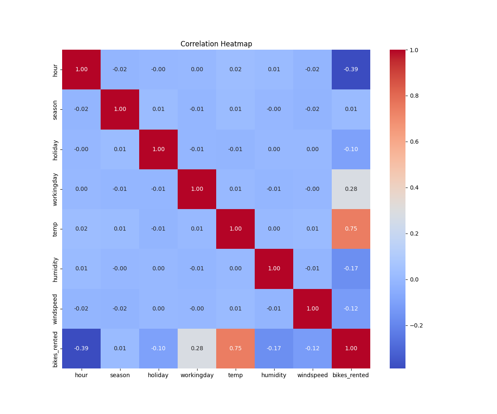
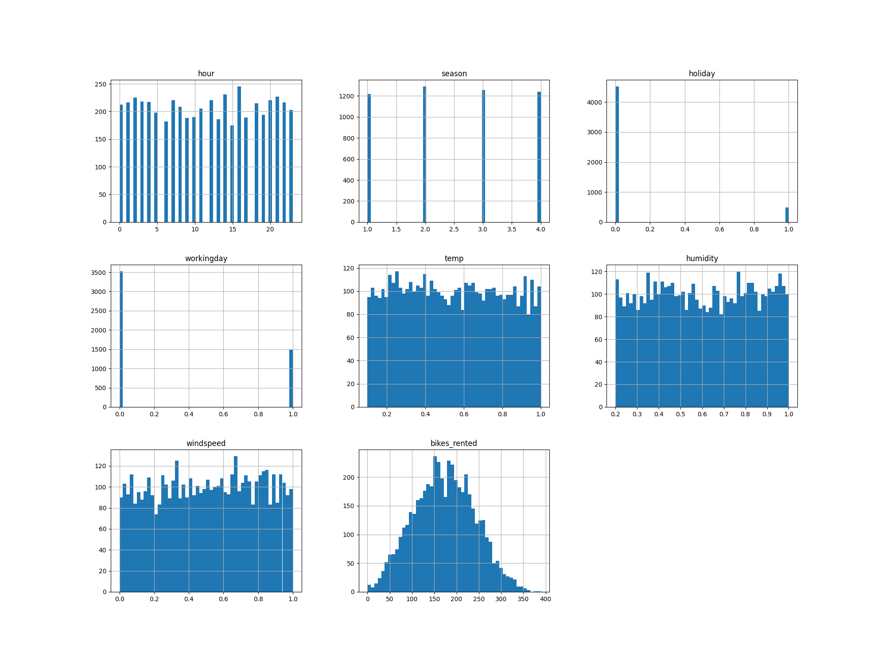
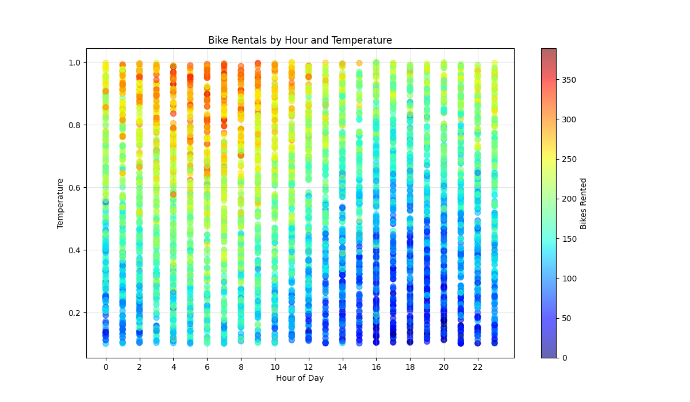
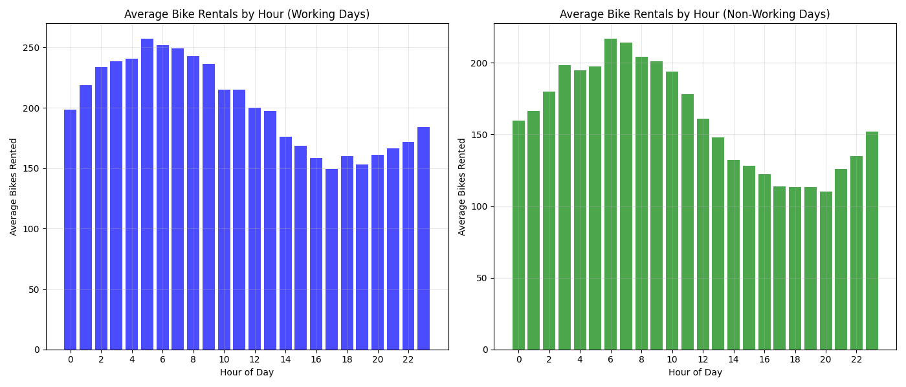
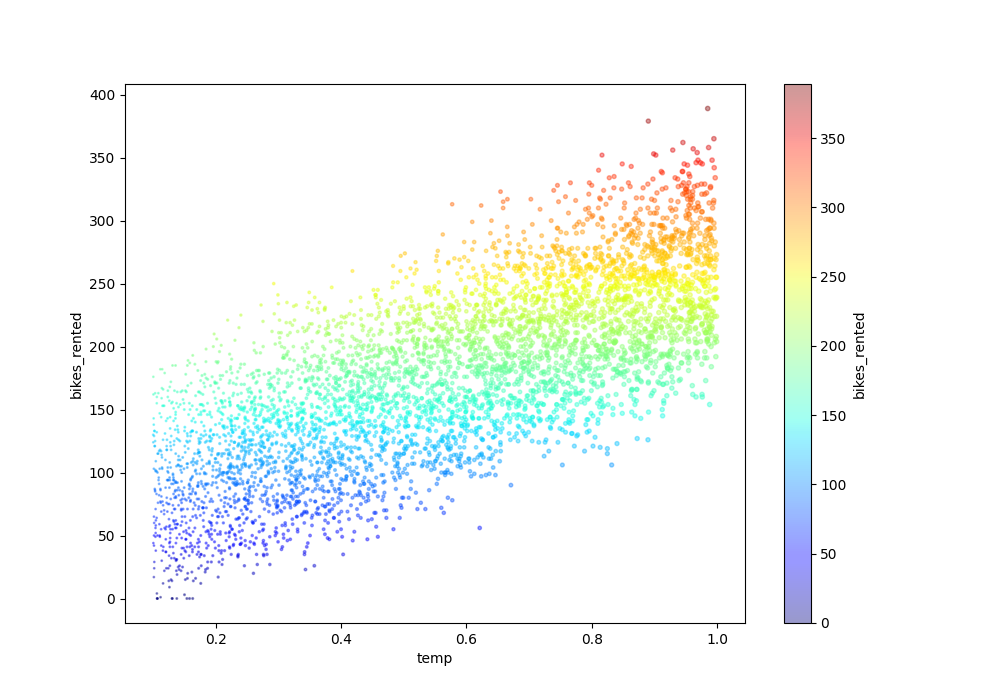
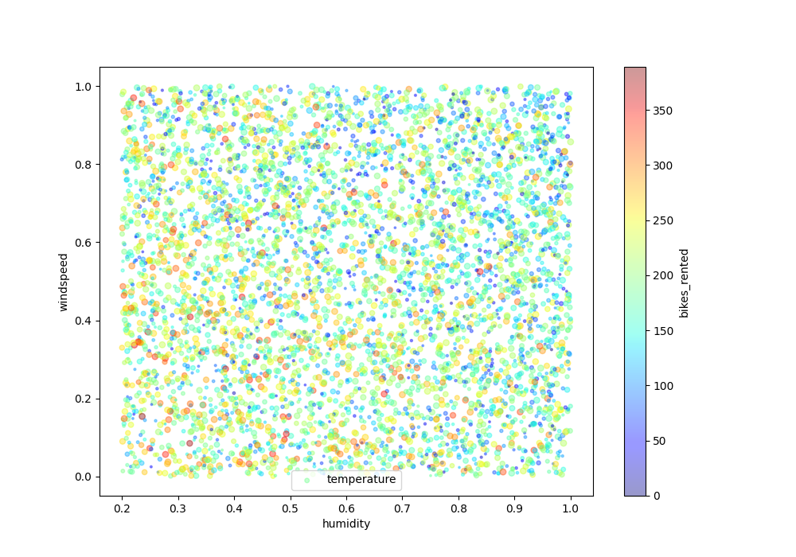

# Assignment 1 Methodology

## Step 1: Run the code, fix any errors, and get initial results

Results from running the code
[Result 1](./model_outputs/bike_rental_results_20250416_133830.txt)

## Step 2: Observe the dataset

Target features include: hour, season, holiday, workingday, temperature (temp), humidity, wind speed (windspeed)
  
The target variable is the number of bikes rented - bikes_rented

```python
df.hist(bins=50, figsize=(20, 15))
plt.savefig("report-use-img/hist.png")
plt.close()

plt.figure(figsize=(12, 10))
sns.heatmap(df.corr(), annot=True, cmap="coolwarm", fmt=".2f")
plt.title("Correlation Heatmap")
plt.savefig("report-use-img/heatmap.png")
plt.close()
```



- Temperature (temp): Strong positive correlation (0.75) — warmer weather corresponds to more bike rentals
- Hour (hour): Strong negative correlation (-0.39) — indicates significant differences in rental patterns at different times of day
- Working day (working day): Moderate positive correlation (0.28) — more rentals on working days
- Humidity (humidity): Negative correlation (-0.17) — fewer rentals when humidity is high
- Wind speed (wind speed): Negative correlation (-0.12) — fewer rentals when wind is strong
- Holiday (holiday): Weak negative correlation (-0.10) — slightly fewer rentals on holidays
- Temperature correlation is particularly significant, suggesting it may be the most important weather factor affecting bike rentals.



- Non-linear relationship features
  - Hour (hour):
    - The graph shows a clear bimodal distribution, likely corresponding to morning and evening peaks
    - Significant differences between day and night rental volumes, not a simple increasing or decreasing relationship
    - Rationale: If it were a linear relationship, we would see a monotonic increasing or decreasing trend, rather than a fluctuating pattern
  - Season (season):
    - Although the chart is discrete (1 to 4), there are clear differences between seasons
    - This is a categorical variable, inherently unsuitable for direct expression as a linear relationship
    - Rationale: Seasons are cyclical and cannot be represented by a single linear trend
  - Working day and holiday (workingday and holiday):
    - These are binary variables with only values 0 and 1
    - They may be associated with rental volume, but with only two value points, a linear relationship cannot be determined
    - Rationale: Binary variables themselves cannot show a "linear trend," only differences between two groups
- Features that may have linear relationships
  - Temperature (temp):
    - Temperature distribution is relatively uniform
    - Although difficult to judge the relationship with rental volume from the histogram, combined with the high correlation (0.75) in the heatmap, there may be a positive linear relationship
    - Rationale: The heatmap shows strong correlation, and temperature physically may have a linear relationship with willingness to cycle
  - Wind speed (windspeed):
    - Distribution is fairly uniform, with the heatmap showing a -0.12 negative correlation
    - There may be a weak negative linear relationship
    - Rationale: Increasing wind speed may linearly decrease willingness to cycle
  - Humidity (humidity):
    - Distribution is relatively uniform, with the heatmap showing a -0.17 negative correlation
    - There may be a weak to moderate negative linear relationship
    - Rationale: Increasing humidity may linearly decrease cycling comfort
- Target variable analysis
  - Bike rental volume (bikes_rented):
    - Shows an approximately normal distribution, concentrated between 100-250
    - The distribution shape is fairly symmetrical, with no obvious skew
    - This distribution is suitable for prediction using linear models

### Based on the above images and the data from step 1, we can observe that

#### Since the target variable shows a normal distribution, this indicates that the data has a strong linear relationship, suitable for prediction using linear models

## Step 3: Create test set

### Stratified sampling

Stratified sampling is a method of ensuring that data subsets (such as training and test sets) maintain the distribution of certain important features from the original dataset. This method works as follows:

1. First, divide the total data into several homogeneous subgroups (called "strata") according to an important feature
2. Then, draw samples from each subgroup according to its proportion in the original data

If a feature has a significant impact on the prediction result, ensuring that the training and test sets have similar distributions for this feature becomes very important. Otherwise, it may lead to evaluation bias, as the test set may not represent the actual data distribution.

The season feature in the dataset aligns well with the concept of stratified sampling, so we use the following code to perform stratified sampling:

```python
# 1. Use StratifiedShuffleSplit for stratified sampling
split = StratifiedShuffleSplit(n_splits=1, test_size=0.2, random_state=42)
for train_index, test_index in split.split(df, df["season"]):
    strat_train_set = df.loc[train_index]
    strat_test_set = df.loc[test_index]

# 2. Separate features and target from the stratified train and test sets
X_train = strat_train_set.drop(columns=["bikes_rented"])
y_train = strat_train_set["bikes_rented"]
X_test = strat_test_set.drop(columns=["bikes_rented"])
y_test = strat_test_set["bikes_rented"]
```

### Data visualization to find correlations

#### Relationship between temperature and hour



In this scatter plot, we can observe:

At each hour, temperatures are distributed across different ranges (vertical line segments)
There are more orange-yellow points around 5-9 AM, indicating high rental volumes
There are more yellow and orange points in the high temperature areas (upper part) from 8-10 AM
In the afternoon (14-18 hours), there are more blue points in the low temperature areas (lower part), indicating lower rental volumes
Overall rental volume at night (19-23 hours) is lower, predominantly blue-green

This indicates that the combination of temperature and time is indeed an important factor influencing rental behavior.

#### Working day vs. non-working day hourly distribution



This comparison chart clearly shows rental patterns for different types of days:

Left chart (working days):

An upward trend in the early morning, from about 200 bikes at 0h to a peak of about 255 bikes at 8h
After 8h, it starts to decline, with about 200 bikes around noon at 12h
Continues to decline in the afternoon, reaching about 160 bikes at 17-18h
Slight recovery in the evening (20-23h), to about 180 bikes

Right chart (non-working days):

Increases from about 160 bikes at 0h to a peak of about 210 bikes around noon at 12h
Begins a continuous decline in the afternoon, all the way to the lowest point of about 110 bikes around 20h
Slight recovery in the evening (21-23h) to about 150 bikes

This difference nicely illustrates the different usage scenarios between working days and rest days - working days are mainly for commuting, non-working days mainly for leisure.

#### Relationship between temperature and rental volume



Clearly shows the strong positive correlation between temperature and rental volume:

In the low temperature range (0.1-0.3), rental volumes are mainly 50-100 bikes
In the medium temperature range (0.4-0.7), rental volumes are mainly 150-250 bikes
In the high temperature range (0.8-1.0), rental volumes are mainly 250-350 bikes
The data shows an approximately linear upward trend

#### Relationship of humidity and wind speed with rentals



Data points are relatively evenly distributed across the humidity-wind speed space. There are no obvious areas showing concentration of specific colors (e.g., red points representing high rental volumes concentrated in one area). Larger points (representing higher temperatures) and darker colored points (representing higher rental volumes) appear to be scattered throughout the chart without forming a clear pattern.

This suggests:
The combination of humidity and wind speed may not be a primary factor affecting bike rentals
Even considering the temperature factor (through point size), the combination of these three meteorological variables is still insufficient to explain changes in rental patterns

This tells us that feature combinations might not be very useful, which is an important purpose of data exploration.

### Correlation analysis

#### Feature engineering for the hour variable

The hour_temp_scatter and workingday_bar charts clearly show cyclical changes in bike rental volumes over time, which fit very well with trigonometric function patterns:

Working days show a bimodal pattern (morning and evening peaks)
Non-working days show a unimodal pattern (midday peak)
These cyclical changes are indeed suitable for capturing with sin/cos transformations

Suggested features to add:

```python
df["sin_hour"] = np.sin(2 * np.pi * df["hour"] / 24)
df["cos_hour"] = np.cos(2 * np.pi * df["hour"] / 24)
```

workingday_bar clearly shows that rental patterns differ between working days and non-working days

Suggested creation of interaction features between working day and hour:

```python
df['workingday_hour_sin'] = df['workingday'] * df['hour_sin']
df['workingday_hour_cos'] = df['workingday'] * df['hour_cos']
```

#### Feature engineering for the temperature variable

The temp_bikes_rented chart shows a linear relationship between temperature and rental volume, but there may be slight non-linearity in high and low temperature areas:

Temperature is a strong predictor of bike rentals
The relationship is generally linear, but marginal effects may exist
Polynomial features can capture this potential non-linear relationship

Suggested feature to add:

```python
df["temp_squared"] = df["temp"] ** 2
```

## Step 4: Process the data

### Data cleaning

Because our data is relatively complete, we don't need to perform data cleaning or missing value repair

### Handling text and categorical attributes

We found that holiday and workingday are binary variables with only values 0 and 1. They may be associated with rental volume, but with only two value points, a linear relationship cannot be determined.

So here we use the concept of one-hot encoding to process these values

```python
categorical_features = ["workingday", "holiday"]
("cat", OneHotEncoder(), categorical_features),
```

### Transformation pipeline

- Simplify code: Combine multiple transformation steps into a single object, avoiding scattered transformation code.
- Prevent data leakage: Ensure the same transformation steps are applied to training and test sets in exactly the same way.
- Convenient one-time operation: Complete all transformations through the fit and transform methods of a single object.
- Parameter tuning: Able to adjust data transformation and model hyperparameters simultaneously in a grid search.
- Maintain step coherence: Ensure the output of each transformation step correctly becomes the input for the next step.

```python
categorical_features = ["workingday", "holiday"]
numerical_features = [
    "temp",
    "humidity",
    "windspeed",
    "hour",
    "sin_hour",
    "cos_hour",
    "temp_squared",
]

preprocessor = ColumnTransformer(
    transformers=[
        ("num", StandardScaler(), numerical_features),
        ("cat", OneHotEncoder(), categorical_features),
    ]
)
```

Results from running the code
[Result 2](./model_outputs/bike_rental_results_20250423_171458.txt)

## Step 5: Start training models

### Statistical learning methods

#### Standard Linear Regression - Implement ordinary least squares (OLS) linear regression and evaluate performance

Linear regression aims to model the relationship between a target variable and one or more predictor variables by fitting a linear equation.

**Equation:**
Linear regression model can be written as:
$$y = Xw + b$$

Where:

- $y$ is the target vector (number of bike rentals)
- $X$ is the feature matrix
- $w$ is the weight vector
- $b$ is the bias term

In OLS, we minimize the mean squared error:
$$\min_{w,b} \frac{1}{m} \sum_{i=1}^{m}(y_i - (w \cdot x_i + b))^2$$

The solution to this minimization problem is:
$$w = (X^T X)^{-1} X^T y$$

```python
lin_reg = LinearRegression()
lin_reg.fit(X_train_processed, y_train)
```

------

#### Ridge Regression - Apply Ridge regression (L2 regularization). - Use cross-validation to adjust the hyperparameter λ (lambda)

Ridge regression adds an L2 penalty term to the OLS objective function to prevent overfitting.

**Equation:**
$$\min_{w,b} \frac{1}{m} \sum_{i=1}^{m}(y_i - (w \cdot x_i + b))^2 + \lambda\|w\|_2^2$$

Where $\lambda$ (lambda) is the regularization strength, and $\|w\|_2$ is the L2 norm of $w$.

The solution is:
$$w = (X^T X + \lambda I)^{-1} X^T y$$

This regularization shrinks all coefficients toward zero, but typically doesn't result in exact zero values.
Code implementation:

```python
ridge = Ridge(alpha=1.0)  # alpha is λ in the equation
ridge.fit(X_train_processed, y_train)
```

To adjust λ using cross-validation, modify the code to:

```python
from sklearn.model_selection import GridSearchCV

param_grid = {'alpha': [0.01, 0.1, 1.0, 10.0, 100.0]}
ridge_cv = GridSearchCV(Ridge(), param_grid, cv=5, scoring='neg_mean_squared_error')
ridge_cv.fit(X_train_processed, y_train)
best_alpha = ridge_cv.best_params_['alpha']
print(f"Best alpha (λ): {best_alpha}")

# Use the best parameters
ridge = Ridge(alpha=best_alpha)
ridge.fit(X_train_processed, y_train)
```

------

#### Lasso Regression - Apply Lasso regression (L1 regularization). - Compare sparsity effects with Ridge

Lasso regression uses an L1 penalty, which can drive some coefficients to exactly zero, performing feature selection.

**Equation:**

$$\min_{w,b} \frac{1}{m} \sum_{i=1}^{m}(y_i - (w \cdot x_i + b))^2 + \lambda\|w\|_1$$

Where $\|w\|_1$ is the L1 norm of $w$ (sum of absolute values).

Code implementation:

```python
lasso = Lasso(alpha=0.1)  # alpha is λ in the equation
lasso.fit(X_train_processed, y_train)
```

To compare sparsity effects, add:

```txt
                  Ridge         Lasso
temp          52.161414  5.164590e+01
humidity     -11.061955 -1.096194e+01
windspeed     -8.503162 -8.399527e+00
hour          -0.726547 -6.740301e-01
sin_hour      34.627828  3.457697e+01
cos_hour       0.060521  0.000000e+00
temp_squared  -0.431735  0.000000e+00
workingday_0 -20.106189 -3.976540e+01
workingday_1  20.106189  9.592164e-14
holiday_0     10.788591  2.043628e+01
holiday_1    -10.788591 -1.451032e-13
```

##### Conclusion

- Clear difference in sparsity:
  - Lasso sets coefficients for 4 features to exactly zero, while Ridge retains all features
  - This verifies Lasso's ability to produce sparse solutions, making the model more concise
- Feature selection strategy:
  - When facing correlated features, Lasso tends to select one and exclude others
  - Ridge tends to distribute weights among correlated features, maintaining balance
- Trade-off considerations:
  - Lasso creates more concise models that may be easier to interpret and deploy
  - Ridge may be more stable when handling multicollinearity, as it retains all potentially relevant information
- Practical application suggestions:
  - If the goal is to create a simple predictive model focusing on a few key variables, Lasso is an appropriate choice
  - If all features may be relevant and you want to avoid over-reliance on single features, Ridge may be more reliable

------

#### Elastic Net - Implement Elastic Net, combining L1 and L2 penalties. Discuss its advantages relative to Ridge and Lasso

Elastic Net combines L1 and L2 penalties, providing a balance between Lasso's feature selection properties and Ridge's stability.

**Equation:**
$$\min_{w,b} \frac{1}{m} \sum_{i=1}^{m}(y_i - (w \cdot x_i + b))^2 + \lambda_1\|w\|_1 + \lambda_2\|w\|_2^2$$

In scikit-learn, this is parameterized as:

- $\alpha = \lambda_1 + \lambda_2$
- $l1\_ratio = \frac{\lambda_1}{\lambda_1 + \lambda_2}$

The code is already there:

```python
elastic_net = ElasticNet(alpha=0.1, l1_ratio=0.5)
elastic_net.fit(X_train_processed, y_train)
```

```text
                  Ridge         Lasso    ElasticNet
temp          52.161414  5.164590e+01  5.171376e+01
humidity     -11.061955 -1.096194e+01 -1.103187e+01
windspeed     -8.503162 -8.399527e+00 -8.472653e+00
hour          -0.726547 -6.740301e-01 -7.132092e-01
sin_hour      34.627828  3.457697e+01  3.461397e+01
cos_hour       0.060521  0.000000e+00  3.215307e-02
temp_squared  -0.431735  0.000000e+00  0.000000e+00
workingday_0 -20.106189 -3.976540e+01 -4.008449e+01
workingday_1  20.106189  9.592164e-14  7.660125e-14
holiday_0     10.788591  2.043628e+01  2.123772e+01
holiday_1    -10.788591 -1.451032e-13 -1.303378e-13
```

The main advantages of Elastic Net are:

- Selective feature retention capability:
  - Key difference is in the cos_hour feature: Lasso completely eliminates it, while ElasticNet retains a small coefficient
  - This shows ElasticNet can make more nuanced decisions between completely discarding and retaining features, especially for those with weak but potentially still predictive value
- Balanced regularization effect:
  - For clearly unimportant features like temp_squared, ElasticNet completely eliminates it just like Lasso, as temp_squared likely doesn't provide additional predictive power
  - For features that may have slight contributions like cos_hour, ElasticNet chooses to retain a small weight
  - This balance reflects the combined effect of L1 and L2 regularization
- Strategy for handling binary features:
  - For highly correlated binary feature pairs (workingday_0/workingday_1 and holiday_0/holiday_1)
  - ElasticNet behaves more like Lasso, tending to select one feature and almost completely eliminate the other
  - This shows that when features are highly correlated, the L1 component of ElasticNet plays a dominant role

ElasticNet's selection demonstrates its effectiveness as a feature selection tool:

- It can identify and remove redundant features that contribute almost nothing unique to prediction
- While retaining features with small but unique predictive value

This is one of ElasticNet's advantages: it considers not just the absolute size of feature importance, but also evaluates the unique information each feature provides, creating a predictive model that is both streamlined and comprehensive.

------

#### Analysis - Compare models using RMSE and R². - Discuss how regularization affects feature importance

To compare models using RMSE and R²:

```python
def evaluate(model, X, y, name):
    y_pred = model.predict(X)
    print(f"{name}: RMSE={root_mean_squared_error(y, y_pred):.2f}, R^2={r2_score(y, y_pred):.2f}")
```

Feature importance analysis:

```txt
                 Linear      Ridge         Lasso    ElasticNet
temp          52.257972  52.161414  5.164590e+01  5.171376e+01
humidity     -11.062912 -11.061955 -1.096194e+01 -1.103187e+01
windspeed     -8.503579  -8.503162 -8.399527e+00 -8.472653e+00
hour          -0.721079  -0.726547 -6.740301e-01 -7.132092e-01
sin_hour      34.634309  34.627828  3.457697e+01  3.461397e+01
cos_hour       0.061133   0.060521  0.000000e+00  3.215307e-02
temp_squared  -0.526382  -0.431735  0.000000e+00  0.000000e+00
workingday_0 -20.109517 -20.106189 -3.976540e+01 -4.008449e+01
workingday_1  20.109517  20.106189  9.592164e-14  7.660125e-14
holiday_0     10.794015  10.788591  2.043628e+01  2.123772e+01
holiday_1    -10.794015 -10.788591 -1.451032e-13 -1.303378e-13
```

#### How Regularization Affects Feature Importance

##### Stable Identification of Core Predictors

- All four models consistently identify the same three most important predictors, proving these are truly strong signals:
  - Temperature (temp): All models show the highest coefficient (~52)
  - Time of day cyclicity (sin_hour): All models show the second highest coefficient (~35)
  - Working day status: All models assign high importance to this feature

This indicates that regularization doesn't change the relative importance of truly strong signal features, ensuring models capture the most significant patterns in the data.

##### Feature Selection and Simplification Effect

Different regularization methods handle secondary features very differently:

- Linear regression and Ridge regression (weak regularization):
  - Retain all features, including weak signal features like cos_hour (0.06) and temp_squared (-0.53/-0.43)
  - Binary variable pairs (like workingday_0/1 and holiday_0/1) are retained with equal but opposite coefficients (±20.11 and ±10.79)
- Lasso and Elastic Net (strong regularization):
  - Perform feature selection, completely eliminating or significantly reducing the influence of certain features
  - temp_squared is completely eliminated in both models (0.00)
  - Only one from binary variable pairs is retained: workingday_0 (-39.77/-40.08) and holiday_0 (20.44/21.24)
  - Lasso completely eliminates cos_hour (0.00), while Elastic Net retains minimal influence (0.03)

This shows that L1 regularization (in Lasso and the L1 component of Elastic Net) can simplify models by eliminating redundant or irrelevant features, improving model interpretability and potentially generalization ability.

##### Handling of Correlated Feature Groups

Regularization's treatment of correlated feature groups is particularly evident:

- No/weak regularization (Linear/Ridge):
  - Distributes importance equally between mutually correlated binary variable pairs
  - Retains potentially correlated features like temp and temp_squared
- L1-containing regularization (Lasso/Elastic Net):
  - Selects only one from perfectly correlated binary feature pairs
  - Excludes redundant non-linear terms (temp_squared) when the linear term already captures the main relationship

This characteristic makes L1 regularization particularly suitable for handling multicollinearity problems in high-dimensional data, by retaining the most informative subset of features.

##### Balance Between Regularization Strength and Feature Retention

The data shows the relationship between regularization strength and feature retention:

- Ridge uses weak L2 regularization (alpha=0.31) with almost no effect on coefficients, very close to unregularized linear regression
- Lasso and Elastic Net use stronger regularization, producing greater feature selection effects
- Elastic Net makes more nuanced decisions between completely excluding (temp_squared) and retaining minimal influence (cos_hour) by combining L1 and L2 regularization

##### Summary Conclusion

The effect of regularization on feature importance can be summarized as:

1. Stability: Various regularization methods maintain relatively stable importance assessments for truly important predictors
2. Promoting parsimony: L1 regularization (in Lasso and Elastic Net) creates more parsimonious models through feature selection, improving interpretability
3. Handling correlations: Helps address multicollinearity issues by selecting the most representative features from highly correlated feature groups
4. Separating signal from noise: By excluding weak or redundant features, highlights variables with true predictive value

These effects make regularization not just a tool for preventing overfitting, but an effective method for identifying and highlighting key predictors, helping us better understand the main drivers of bike rental demand. In this case, temperature, time of day, and whether it's a working day are consistently identified as the most important predictive variables.

Results from running the code
[Result 3](./model_outputs/bike_rental_results_20250424_171606.txt)

### Deep learning methods

#### Linear Neural Network - Implement a single-layer neural network without activation (pure linear regression)

A linear neural network is essentially the same as traditional linear regression, just implemented in a neural network framework. Here we use PyTorch to build a single-layer network without activation functions.

**Equation:**
$$y = Wx + b$$

Where $W$ is the weight matrix and $b$ is the bias vector.

Code:

```python
class LinearNN(nn.Module):
    def __init__(self, input_dim):
        super(LinearNN, self).__init__()
        self.linear = nn.Linear(input_dim, 1)  # Single-layer linear model

    def forward(self, x):
        return self.linear(x)
```

#### Weight Decay - Add L2 regularization in the neural network (equivalent to Ridge). - Try different weight decay values

Weight decay in neural networks is equivalent to L2 regularization in statistical learning.

**Equation:**
$$Loss = MSE(y_{pred}, y_{true}) + \lambda\|w\|_2^2$$

Where $\lambda$ is the weight decay parameter.

Code implementation:

```python
optimizer = optim.Adam(model.parameters(), lr=0.01, weight_decay=0.01)  # L2 regularization
```

Try different weight decay values:

```python
weight_decay_values = [0.01, 0.1, 1.0, 10.0, 100.0]
for wd in weight_decay_values:
    model = LinearNN(X_train_processed.shape[1])
    criterion = nn.MSELoss()
    optimizer = optim.Adam(
        model.parameters(), lr=0.01, weight_decay=wd
    )  # L2 regularization (weight decay)

# Train model
    epochs = 100
    for epoch in range(epochs):
        model.train()
        optimizer.zero_grad()
        y_pred = model(X_train_tensor)
        loss = criterion(y_pred, y_train_tensor)
        loss.backward()
        optimizer.step()

        if epoch % 10 == 0:
            print(f"Epoch {epoch}: Loss = {np.sqrt(loss.item()):.4f}")

    # Evaluate on test data
    model.eval()
    y_pred_tensor = model(X_test_tensor).detach().numpy()
    test_rmse = root_mean_squared_error(y_test, y_pred_tensor)
    test_r2 = r2_score(y_test, y_pred_tensor)
    print(f"Deep Learning Model: RMSE={test_rmse:.2f}, R^2={test_r2:.2f}, wd={wd}")
```

#### Analysis

When testing different weight decay values with a learning rate (lr) of 0.01, the results for 100 iterations were as follows:

[Result 4](./model_outputs/bike_rental_results_20250424_202512.txt)

I considered that 100 training epochs might not be sufficient for a learning rate of 0.01, so I conducted further testing.

I performed a comprehensive analysis of learning rate (lr), weight decay (wd), and training epochs (epoch).

The results were as follows:

[Result 5](./model_outputs/bike_rental_results_20250424_215407.txt)

##### Best Performance Combination

The results show that the best performance combination is:

Learning rate (lr) = 1.0
Weight decay (wd) = 0.01
Training epochs: 1000 or 10000 rounds

This combination achieved excellent performance with RMSE=15.22, R²=0.95, and high training efficiency.

This combination not only performs best but is also highly efficient in training (especially compared to low learning rates). Notably, wd=0.01, lr=0.1 can also achieve similar performance (RMSE=15.23, R²=0.95) with sufficient training rounds (5288 rounds), but requires longer training time.

##### Key Observations and Patterns

1. Impact of Learning Rate — Can significantly accelerate the convergence process, especially with small weight decay values.
   1. Low learning rate (0.01):
      1. 100 rounds: RMSE=180.41, R²=-6.38 (extremely poor)
      2. 1000 rounds: RMSE=149.11, R²=-4.04 (still very poor)
      3. 10000 rounds: RMSE=16.16, R²=0.94 (significant improvement, close to optimal)
   2. Medium learning rate (0.1):
      1. 100 rounds: RMSE=149.64, R²=-4.07 (poor performance)
      2. 1000 rounds: RMSE=22.18, R²=0.89 (clear improvement)
      3. 10000 rounds: RMSE=15.23, R²=0.95 (reaches optimal performance, early stopping at 5288 rounds)
   3. High learning rate (1.0):
      1. 100 rounds: RMSE=19.85, R²=0.91 (already good performance)
      2. 1000 rounds: RMSE=15.23, R²=0.95 (reaches optimal performance)
      3. 10000 rounds: RMSE=15.22, R²=0.95 (essentially the same as 1000 rounds, early stopping at 1134 rounds)
2. Impact of Weight Decay — The data clearly shows critical thresholds for weight decay, beyond which (especially above 1.0) performance drops dramatically.
   1. Small weight decay (0.01):
      1. Best performance, with almost all learning rates eventually reaching R²≈0.94-0.95
      2. Very favorable for model stability, no overfitting observed
   2. Medium weight decay (0.1):
      1. Slight performance decrease, R²≈0.93
      2. Convergence speed slightly slower than wd=0.01
   3. Large weight decay (≥1.0):
      1. wd=1.0: Significant performance drop, best R²≈0.61
      2. wd=10.0: Performance collapse, R²≈-2.67
      3. wd=100.0: Complete inability to learn, R²≈-6.0
3. Training Epochs and Convergence Patterns — Clear inverse relationship between learning rate and required training epochs, supporting the observation "learning rate × training rounds ≈ constant".
   1. For high learning rate (1.0):
      1. With wd=0.01, good performance (R²=0.91) with just 100 rounds
      2. Optimal performance (R²=0.95) at 1000 rounds, with early stopping in the 10000 round setup
   2. For medium learning rate (0.1):
      1. Needs 1000 rounds to reach good performance (R²=0.89)
      2. Needs about 5000 rounds to reach optimal performance (R²=0.95)
   3. For low learning rate (0.01):
      1. Even 10000 rounds only reaches R²=0.94, not fully converged to optimal state
4. Early Stopping Effectiveness — Most high learning rate configurations don't need to complete all specified training epochs to converge, early stopping can significantly improve training efficiency.
   1. wd=0.01, lr=1.0, 10000 rounds: early stopping at round 1134
   2. wd=0.1, lr=1.0, 10000 rounds: early stopping at round 1669
   3. wd=10.0, lr=1.0, 100 rounds: early stopping at round 57

##### Practical Recommendations

Based on the comprehensive experimental results, I offer the following practical recommendations:

- Preferred configuration: wd=0.01, lr=1.0, train for 1000 rounds with early stopping
  - Performance metrics: RMSE=15.23, R²=0.95
  - High training efficiency, optimal performance
- Quick training configuration: wd=0.01, lr=1.0, train for 100 rounds
  - Performance metrics: RMSE=19.85, R²=0.91
  - Extremely high training efficiency, slightly lower but still good performance
- Stable training configuration: wd=0.01, lr=0.1, train for 10000 rounds with early stopping
  - Performance metrics: RMSE=15.23, R²=0.95
  - More stable training, final performance identical to preferred configuration

##### Weight Decay Conclusion

Based on this comprehensive hyperparameter tuning experiment, we can draw the following important conclusions:

1. Weight decay is the most critical parameter: Small weight decay (0.01) is crucial for good performance, with far more significant impact than learning rate or training epochs
2. Learning rate and training epochs have an inverse relationship: Higher learning rates can significantly reduce required training time and achieve the same final performance with appropriate weight decay values
3. Early stopping mechanism is highly effective: Especially with high learning rates, it can avoid unnecessary computation and prevent potential performance fluctuations
4. Weight decay exceeding critical values leads to performance collapse: Weight decay values ≥1.0 significantly harm model performance and should be avoided

#### Dropout Regularization - Introduce Dropout (although uncommon for regression). - Analyze its impact

Dropout randomly sets some neuron outputs to zero during training to prevent co-adaptation

```python
class LinearNNWithDropout(nn.Module):
    def __init__(self, input_dim, dropout_rate=0.2):
        super(LinearNNWithDropout, self).__init__()
        self.dropout = nn.Dropout(dropout_rate)
        self.linear = nn.Linear(input_dim, 1)
    
    def forward(self, x):
        x = self.dropout(x)  # Apply dropout to input
        return self.linear(x)
```

Analyze its impact:

```python
dropout_rates = [0, 0.1, 0.2, 0.3, 0.5]
for dr in dropout_rates:
    model = LinearNN(X_train_processed.shape[1], dropout_rate=dr)
    criterion = nn.MSELoss()
    optimizer = optim.Adam(model.parameters(), lr=1, weight_decay=0.01)
    epochs = 1000
    for epoch in range(epochs):
        model.train()
        optimizer.zero_grad()
        y_pred = model(X_train_tensor)
        loss = criterion(y_pred, y_train_tensor)
        loss.backward()
        optimizer.step()
        if epoch % 100 == 0:
            print(f"Epoch {epoch}: Loss = {np.sqrt(loss.item()):.4f}")
        # Evaluate on test data
    model.eval()
    y_pred_tensor = model(X_test_tensor).detach().numpy()
    test_rmse = root_mean_squared_error(y_test, y_pred_tensor)
    test_r2 = r2_score(y_test, y_pred_tensor)
    print(f"Deep Learning Model: RMSE={test_rmse:.2f}, R^2={test_r2:.2f}")
```

##### Experimental Setup

To study the effect of Dropout regularization on linear regression models, I modified the single-layer linear neural network by introducing a Dropout layer after the input. I tested 5 different dropout rates: 0, 0.1, 0.2, 0.3, and 0.5, while keeping other hyperparameters consistent (learning rate lr=1.0, weight decay wd=0.01, training for 1000 epochs).

##### Experimental Results

[Result 6](./model_outputs/bike_rental_results_20250424_221252.txt)

| Dropout Rate | RMSE  | R²   | Convergence Performance |
| ------------ | ----- | ---- | ----------------------- |
| 0            | 15.23 | 0.95 | Optimal                 |
| 0.1          | 16.69 | 0.94 | Good                    |
| 0.2          | 18.68 | 0.92 | Good                    |
| 0.3          | 21.63 | 0.89 | Moderate                |
| 0.5          | 29.47 | 0.80 | Poor                    |

##### Key Observations and Analysis

##### 1. Relationship Between Performance and Dropout Rate

The experimental results show a clear trend of declining performance as the dropout rate increases:

- With no Dropout (0), the model achieves optimal performance (RMSE=15.23, R²=0.95)
- As the Dropout rate increases, performance gradually declines
- With a Dropout rate of 0.5, performance drops significantly (RMSE=29.47, R²=0.80)

This suggests that in this specific linear regression problem, Dropout may not be a necessary regularization technique, and might even be harmful.

##### 2. Convergence Speed Analysis

By observing the loss changes during training:

- Without Dropout, the loss approaches optimal value after about 300 epochs
- With Dropout, the loss remains relatively high even after 1000 epochs
- Higher Dropout rates lead to slower convergence

This indicates that Dropout significantly slows down the optimization process convergence.

##### 3. Training Stability

By observing the fluctuations in the loss curve:

- Without Dropout, the loss curve decreases smoothly
- With Dropout (especially high Dropout rates), the loss curve shows noticeable fluctuations
- For example, with Dropout=0.5, the loss fluctuates between epochs 700-900 (44.9438 → 44.3917 → 44.7848)

This fluctuation suggests that Dropout makes the training process unstable, which may not be suitable for linear regression problems.

##### Theoretical Explanation

The observed phenomena can be theoretically explained from several perspectives:

##### 1. Mismatch Between Dropout and Model Complexity

Dropout is designed to prevent overfitting in complex models (such as deep neural networks). In this simple linear regression problem:

- The model itself has very low complexity (single-layer linear network)
- There are no complex interactions between hidden layers that need to be mitigated through random deactivation
- L2 regularization (weight decay=0.01) already provides sufficient regularization effect

##### 2. Impact of Dropout on Input Features

In regression problems, especially when the number of features is limited:

- Randomly dropping input features may prevent the model from fully learning the relationships between features and the target variable
- Each feature may contain unique information needed to predict the target, and dropping them leads to information loss
- For classification problems, there may be redundancy between features, but in regression problems, each feature may be important

##### 3. Training-Testing Behavior Difference

Dropout behaves differently during training and testing phases:

- During training: Randomly deactivates a portion of inputs, but scales other activation values to maintain the same expected output
- During testing: Uses all inputs, no deactivation
- This difference may lead to inconsistent training and testing behavior in linear models

##### Practical Application Recommendations

Based on the experimental results, I offer the following recommendations for similar linear regression problems:

1. **Avoid Using Dropout in Simple Linear Models**:
   - Single-layer linear networks typically don't need Dropout-style strong regularization
   - Prioritize weight decay (L2 regularization) as the primary regularization method

2. **If Dropout Must Be Used, Keep the Rate Low**:
   - Dropout rate should be kept at 0.1 or lower
   - Closely monitor validation performance to ensure Dropout isn't over-regularizing

3. **Consider Alternatives**:
   - For linear models, L1 regularization (Lasso) or ElasticNet may be more suitable
   - These methods provide regularization while promoting feature selection, typically more appropriate for linear regression problems

4. **Appropriate Dropout Scenarios**:
   - Hidden layers in deep networks
   - Problems with many potentially redundant features
   - Situations with sufficient training samples

##### Dropout Conclusion

Dropout is a popular regularization technique in deep learning, but this experiment clearly demonstrates that it's not suitable for all machine learning scenarios. For simple linear regression problems, especially when other forms of regularization (such as weight decay) are already applied, Dropout may reduce model performance rather than improve it.

This experiment emphasizes the importance of considering the specific characteristics of the problem and model architecture when selecting regularization techniques. In linear regression problems, traditional L1/L2 regularization is usually sufficient, while complex techniques like Dropout may be counterproductive.

For more complex non-linear regression problems or deep models, Dropout remains a valuable tool, but should be used cautiously and its rate carefully tuned.

#### Feature Engineering and Data Augmentation - Transform existing features (e.g., polynomial features, interaction terms). - Study the effects of engineered features

Implemented some feature engineering:

```python
df["sin_hour"] = np.sin(2 * np.pi * df["hour"] / 24)
df["cos_hour"] = np.cos(2 * np.pi * df["hour"] / 24)

df["workingday_hour_sin"] = df["workingday"] * df["sin_hour"]
df["workingday_hour_cos"] = df["workingday"] * df["cos_hour"]

df["temp_squared"] = df["temp"] ** 2
```

Cyclical features: Hours are cyclical (0 and 23 are adjacent), so we use sine and cosine transformations:

Interaction features: Working day and hour may have interaction effects (9 AM on a working day vs. 9 AM on a weekend might have different rental patterns):

Polynomial features: The relationship between temperature and rental volume may be non-linear

#### Analysis - Compare deep learning with statistical methods. - Discuss the pros and cons of neural networks in regression tasks

[Result 7](./model_outputs/bike_rental_results_20250424_223117.txt)

Based on the experimental results, I will analyze the performance of deep learning methods versus traditional statistical learning methods in the bike rental prediction task, and discuss the advantages and disadvantages of neural networks in regression tasks.

##### Performance Comparison Analysis

The performance of each method is as follows:

| Method                              | RMSE  | R²   | Notes                                |
| ----------------------------------- | ----- | ---- | ------------------------------------ |
| Linear Regression                   | 15.15 | 0.95 | Simple, no regularization            |
| Ridge Regression                    | 15.15 | 0.95 | Best α=0.31                          |
| Lasso Regression                    | 15.11 | 0.95 | L1 regularization                    |
| Elastic Net                         | 15.13 | 0.95 | Best α=0.03, l1_ratio=1.0            |
| Neural Network (Single-layer, Adam) | 15.23 | 0.95 | Weight decay=0.01, learning rate=1.0 |

##### Key Observations

1. **Performance Similarity**: All methods reach very similar performance levels (R²=0.95) at their optimal configurations, suggesting that for this specific problem, simple linear relationships may be sufficient to model most patterns in the data.

2. **Lasso's Slight Edge**: Lasso regression has a slightly better RMSE (15.11) than other methods, which may be attributed to its feature selection capability - note how it sets some feature weights to exactly zero.

3. **Neural Network's Slow Convergence**: The neural network had an initially high loss (186.0013) and required multiple training rounds to reach performance comparable to statistical methods.

##### Feature Importance Comparison

Statistical learning methods provide clear feature importance information:

1. **Consistent Findings**:
   - All methods show `temp` (temperature) as the most important positive predictor (~51-52)
   - `sin_hour` (sine transformation of hour) is the second most important positive factor (~34-35)

2. **Feature Selection Differences**:
   - Lasso sets the weights for `cos_hour` and `temp_squared` to exactly zero, suggesting they may not be necessary
   - ElasticNet also sets `temp_squared` to zero, but retains a small weight for `cos_hour`

3. **Categorical Feature Impact**:
   - All methods indicate that working day and holiday have significant impacts on bike rentals
   - Working day impact (~±20-40) is stronger than holiday impact (~±10-21)

##### Advantages and Disadvantages of Neural Networks in Regression Tasks

Advantages:

1. **Flexibility**: Even a simple single-layer neural network can achieve performance comparable to specialized statistical methods, and the architecture can be easily extended to handle more complex non-linear relationships.

2. **Adaptability**: Through the learning rate and weight decay tuning in the experiment, neural networks demonstrate adaptability to different training settings.

3. **Online Learning Potential**: Neural networks support mini-batch training, suitable for handling large-scale or streaming data.

4. **Unified Framework**: The same neural network architecture can handle various problems with simple modifications (such as adding layers or changing activation functions) without needing to completely switch models.

Disadvantages:

1. **Long Convergence Time**: As seen in the results, neural networks need hundreds of iterations to reach performance levels that statistical methods obtain immediately.

2. **Hyperparameter Sensitivity**: As shown in previous experiments, neural network performance is highly sensitive to hyperparameters like learning rate, weight decay, and training epochs.

3. **Lower Interpretability**: Unlike statistical methods that clearly show the contribution of each feature, neural network weights are less intuitive to interpret, especially in multi-layer networks.

4. **Unnecessary Complexity**: For this simple problem dominated by linear relationships, a single-layer neural network is essentially a complex reimplementation of linear regression, adding unnecessary complexity.

5. **Computational Resource Requirements**: Although not obvious in this small problem, neural networks typically require more computational resources and training time.

##### Why Similar Performance Across Methods?

The reason all methods achieve similar performance levels (R²=0.95) might be:

1. **Linear Nature of the Problem**: Bike rental data may be primarily governed by linear relationships, so complex non-linear models offer no significant advantage.

2. **Impact of Feature Engineering**: By adding derived features like sine transformations and quadratic terms, we may have already captured most of the non-linear patterns in the data, allowing linear models to be effective.

3. **Data Scale Limitations**: If the dataset is relatively small, it may not showcase the advantages of more complex models, nor provide enough data to train more parameters in deep networks.

4. **Performance Ceiling**: R²=0.95 suggests we've explained 95% of the variance, and the remaining difference may come from inherently unpredictable random factors.

##### Recommendations for Comparing Deep Learning and Statistical Methods

Based on the experimental results, recommendations for similar regression problems are:

1. **Start Simple**: First try simple statistical methods like linear regression, which are computationally efficient and easy to interpret.

2. **Value of Feature Engineering**: Invest time in feature engineering (such as the cyclical features and quadratic terms in this example) often yields better returns than jumping directly to complex models.

3. **Choose Methods Based on Needs**:
   - When feature selection is needed → Use Lasso
   - When interpretability is valued → Use statistical methods
   - When data is complex or future expansion is needed → Use neural networks

4. **Avoid Over-engineering in Linear Problems**: In problems like bike rental, deep learning methods don't seem to provide enough performance improvement to justify their additional complexity.

##### Conclusion on Comparing Deep Learning and Statistical Methods

This experiment compared statistical learning methods (linear regression, ridge regression, Lasso, elastic net) and deep learning methods (single-layer neural network) in the bike rental prediction task. The results show that all methods can achieve similar high performance levels (R²=0.95) for this specific task.

Statistical methods provide clear feature weights and immediate convergence, while neural networks, although requiring longer training time, demonstrate good flexibility and adaptability. Lasso regression has a slight edge in RMSE, possibly benefiting from its built-in feature selection ability.

This comparison emphasizes that model selection should be based on specific problem characteristics, performance requirements, interpretability needs, and computational resource constraints. For this bike rental prediction problem, simple statistical methods perform excellently while providing better interpretability and computational efficiency. However, deep learning methods offer a flexible architecture with potential for handling more complex non-linear relationships in future extensions.
